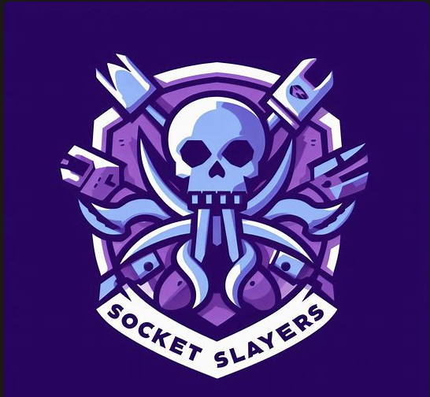

# FTP Server and Client Project

## Introduction

This is an FTP (File Transfer Protocol) server and client project that aims to provide simplified FTP functionality. The server and client allow file uploads, downloads, and file listing operations. This README provides an overview of the project, its structure, and instructions for running and contributing to it.

**Note**: This README is a work in progress, and the project code is not yet finalized. It will be updated as the project evolves.

## Project Information

This project is a collaborative effort by a group of students, ⚔️Socket Slayers⚔️, enrolled in the Computer Communications (CPSC471-04) course at California State University Fullerton, taught by Professor Mutalip Kurban.

⚔️SOCKET SLAYERS⚔️ Group Members:

- [Abel Mendoza](https://github.com/abelxmendoza)
- [Member 2 Name](https://github.com/member2username)
- [Member 3 Name](https://github.com/member3username)
- [Member 4 Name](https://github.com/member4username)
- [Member 5 Name
  ](https://github.com/member5username)




## Table of Contents

- [Features](#features)
- [Prerequisites](#prerequisites)
- [Getting Started](#getting-started)
- [Project Structure](#project-structure)
- [Usage](#usage)
- [Contributing](#contributing)
- [License](#license)

## Features

- **FTP Server**
  - List files in the server directory.
  - Accept file uploads from clients.
  - Serve files to clients.
- **FTP Client**
  - Connect to the FTP server.
  - List files on the server.
  - Download files from the server.
  - Upload files to the server.

## Prerequisites

- Python (version X.X.X)
- Additional dependencies (if any)
- Operating system compatibility (e.g., Windows, Linux, macOS)

## Getting Started

To get started with this project, follow these steps:

1. Clone the project repository to your local machine:

   ```shell
   git clone https://github.com/yourusername/ftp-server-client.git
   ```

## Project Structure

* `/server`: Contains the server-side code.
* `/client`: Contains the client-side code.
* `/tests`: Contains unit tests and test data.

[Optional: Describe the high-level directory structure and main files.]

## Usage

[Provide usage instructions for running the project, including how to start the server and client, execute commands, etc.]

**Server:**

1. Navigate to the `/server` directory.
2. Run the server script:

```shell
python server.py
```

**Client:**

1. Navigate to the `/client` directory.
2. Run the client script:

```shell
python client.py
```

## Contributing

We welcome contributions from the community. To contribute to this project, follow these steps:

1. Fork the repository.
2. Create a new branch for your feature or bug fix:

```shell
git checkout -b feature-name
```

3. Make your changes and commit them:

```shell
git commit -m 'Add new feature'
```

4. Push your changes to your fork:

```shell
git push origin feature-name
```

5. Create a pull request.

## License

This project is licensed under the [MIT License](https://chat.openai.com/c/LICENSE).
